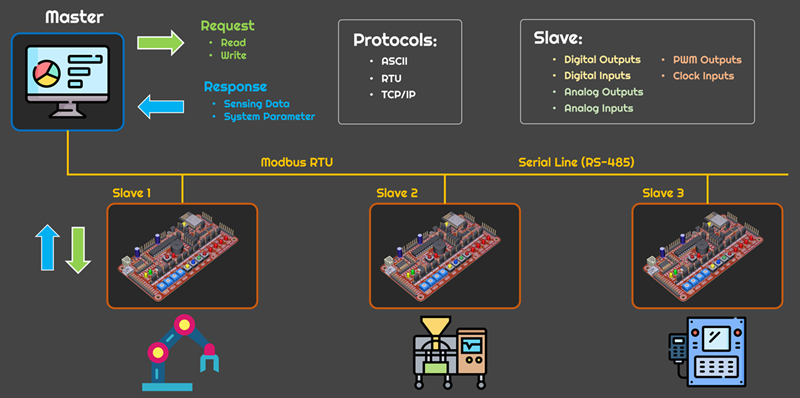

# INC492/693

---

## Software Tools

### :computer: [VSCode](https://code.visualstudio.com/)

### :computer: [Proteus](https://drive.google.com/file/d/1ifG5MsTLwOA2W5cLAon9hA1ISVzIXSe3/view?usp=sharing)

### :computer: [ecc-embedded-2.0.1](tools/ecc-embedded-2.0.1.zip)

### :computer: [ecc-lab-tools-2.0.1](tools/ecc-lab-tools-2.0.1.zip)

### :computer: [Virtual Serial Port Driver](https://drive.google.com/file/d/1rc5c_KIZRt1c3aQr4bRhl9nyJaOfkccu/view?usp=sharing)

### :computer: [ModbusCRCLRC](tools/ModbusCRCLRC.zip)

### :computer: [MudbusFrameBuilder](tools/MudbusFrameBuilder.zip)

> To install the `Proteus` and the `ecc-embedded`, Right-click and choose `Run as administrator`

---
